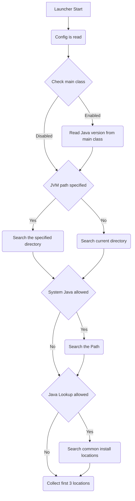

# JVM Selection

By default, Why makes a best-effort attempt to find a valid Java installation 
to use when starting the application. This is that process.

The supplied `jvm_path` may be an absolute path, 
allowing users to force a certain installation to be used.

Each path search checks the `min_java` version required.

3 entries are collected so that if one fails to start 
for any reason the others may be attempted.

